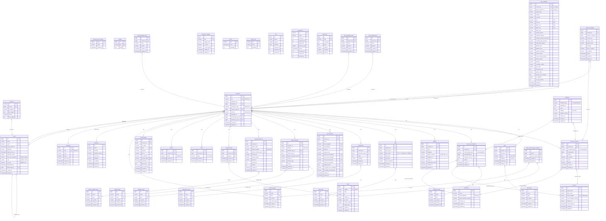

# ERNIE Database ER Diagram

```mermaid
erDiagram
    %% =========================================================================
    %% LOOKUP TABLES (DataCite Controlled Vocabularies)
    %% =========================================================================
    
    resource_types {
        bigint id PK
        varchar name
        varchar slug UK
        boolean is_active
        boolean is_elmo_active
        timestamp created_at
        timestamp updated_at
    }

    title_types {
        bigint id PK
        varchar name
        varchar slug UK
        boolean is_active
        boolean is_elmo_active
        timestamp created_at
        timestamp updated_at
    }

    date_types {
        bigint id PK
        varchar name
        varchar slug UK
        boolean is_active
        timestamp created_at
        timestamp updated_at
    }

    description_types {
        bigint id PK
        varchar name
        varchar slug UK
        boolean is_active
        timestamp created_at
        timestamp updated_at
    }

    contributor_types {
        bigint id PK
        varchar name
        varchar slug UK
        boolean is_active
        timestamp created_at
        timestamp updated_at
    }

    identifier_types {
        bigint id PK
        varchar name
        varchar slug UK
        boolean is_active
        timestamp created_at
        timestamp updated_at
    }

    relation_types {
        bigint id PK
        varchar name
        varchar slug UK
        boolean is_active
        timestamp created_at
        timestamp updated_at
    }

    funder_identifier_types {
        bigint id PK
        varchar name
        varchar slug UK
        boolean is_active
        timestamp created_at
        timestamp updated_at
    }

    languages {
        bigint id PK
        varchar code UK "ISO 639-1"
        varchar name
        boolean active
        boolean elmo_active
        timestamp created_at
        timestamp updated_at
    }

    rights {
        bigint id PK
        varchar identifier UK "SPDX"
        varchar name
        varchar uri
        varchar scheme_uri
        boolean is_active
        boolean is_elmo_active
        int usage_count
        timestamp created_at
        timestamp updated_at
    }

    publishers {
        bigint id PK
        varchar name
        varchar identifier
        varchar identifier_scheme
        varchar scheme_uri
        varchar language
        boolean is_default
        timestamp created_at
        timestamp updated_at
    }

    %% =========================================================================
    %% ENTITY TABLES
    %% =========================================================================

    persons {
        bigint id PK
        varchar family_name
        varchar given_name
        varchar name_identifier UK "ORCID URL"
        varchar name_identifier_scheme
        varchar scheme_uri
        timestamp orcid_verified_at
        timestamp created_at
        timestamp updated_at
    }

    institutions {
        bigint id PK
        varchar name
        varchar name_identifier "ROR URL"
        varchar name_identifier_scheme
        varchar scheme_uri
        timestamp created_at
        timestamp updated_at
    }

    users {
        bigint id PK
        varchar name
        varchar email UK
        timestamp email_verified_at
        varchar password
        timestamp password_set_at
        varchar remember_token
        varchar font_size_preference "default: regular"
        varchar role "default: curator"
        boolean is_active "default: true"
        timestamp deactivated_at
        bigint deactivated_by FK
        timestamp created_at
        timestamp updated_at
    }

    password_reset_tokens {
        varchar email PK
        varchar token
        timestamp created_at
    }

    sessions {
        varchar id PK
        bigint user_id FK
        varchar ip_address "45"
        text user_agent
        longtext payload
        int last_activity
    }

    %% =========================================================================
    %% MAIN RESOURCE TABLE
    %% =========================================================================

    resources {
        bigint id PK
        varchar doi UK "DataCite #1"
        varchar identifier_type
        bigint publisher_id FK
        smallint publication_year "DataCite #5"
        bigint resource_type_id FK
        varchar version "DataCite #15"
        bigint language_id FK
        bigint created_by_user_id FK
        bigint updated_by_user_id FK
        timestamp created_at
        timestamp updated_at
    }

    %% =========================================================================
    %% RESOURCE RELATIONSHIP TABLES
    %% =========================================================================

    titles {
        bigint id PK
        bigint resource_id FK
        bigint title_type_id FK
        varchar value "max 1000"
        varchar language "xml:lang"
        timestamp created_at
        timestamp updated_at
    }

    resource_creators {
        bigint id PK
        bigint resource_id FK
        varchar creatorable_type "Person|Institution"
        bigint creatorable_id
        int position
        boolean is_contact
        varchar email
        varchar website
        timestamp created_at
        timestamp updated_at
    }

    resource_contributors {
        bigint id PK
        bigint resource_id FK
        varchar contributorable_type "Person|Institution"
        bigint contributorable_id
        bigint contributor_type_id FK
        int position
        timestamp created_at
        timestamp updated_at
    }

    affiliations {
        bigint id PK
        varchar affiliatable_type "Creator|Contributor"
        bigint affiliatable_id
        text name
        varchar identifier "ROR URL"
        varchar identifier_scheme
        varchar scheme_uri
        timestamp created_at
        timestamp updated_at
    }

    subjects {
        bigint id PK
        bigint resource_id FK
        varchar value
        varchar language
        varchar subject_scheme "GCMD, MSL, etc."
        varchar scheme_uri
        varchar value_uri
        varchar classification_code
        timestamp created_at
        timestamp updated_at
    }

    dates {
        bigint id PK
        bigint resource_id FK
        bigint date_type_id FK
        varchar date_value "YYYY, YYYY-MM, YYYY-MM-DD"
        varchar start_date
        varchar end_date
        varchar date_information
        timestamp created_at
        timestamp updated_at
    }

    descriptions {
        bigint id PK
        bigint resource_id FK
        bigint description_type_id FK
        text value
        varchar language
        timestamp created_at
        timestamp updated_at
    }

    geo_locations {
        bigint id PK
        bigint resource_id FK
        text place
        decimal point_longitude "11,8"
        decimal point_latitude "10,8"
        decimal elevation "10,2"
        varchar elevation_unit
        decimal west_bound_longitude "11,8"
        decimal east_bound_longitude "11,8"
        decimal south_bound_latitude "10,8"
        decimal north_bound_latitude "10,8"
        json polygon_points
        decimal in_polygon_point_longitude "11,8"
        decimal in_polygon_point_latitude "10,8"
        timestamp created_at
        timestamp updated_at
    }

    related_identifiers {
        bigint id PK
        bigint resource_id FK
        varchar identifier "max 2183"
        bigint identifier_type_id FK
        bigint relation_type_id FK
        varchar related_metadata_scheme
        varchar scheme_uri
        varchar scheme_type
        int position
        timestamp created_at
        timestamp updated_at
    }

    funding_references {
        bigint id PK
        bigint resource_id FK
        varchar funder_name
        varchar funder_identifier "ROR URL"
        bigint funder_identifier_type_id FK
        varchar scheme_uri
        varchar award_number
        varchar award_uri
        text award_title
        int position
        timestamp created_at
        timestamp updated_at
    }

    resource_rights {
        bigint id PK
        bigint resource_id FK
        bigint rights_id FK
        timestamp created_at
        timestamp updated_at
    }

    sizes {
        bigint id PK
        bigint resource_id FK
        varchar value "e.g. 15 MB"
        timestamp created_at
        timestamp updated_at
    }

    formats {
        bigint id PK
        bigint resource_id FK
        varchar value "MIME type"
        timestamp created_at
        timestamp updated_at
    }

    %% =========================================================================
    %% APPLICATION-SPECIFIC TABLES
    %% =========================================================================

    landing_pages {
        bigint id PK
        bigint resource_id FK
        varchar doi_prefix
        varchar slug UK
        varchar template
        varchar ftp_url
        boolean is_published
        varchar preview_token UK
        timestamp published_at
        int view_count
        timestamp last_viewed_at
        timestamp created_at
        timestamp updated_at
    }

    settings {
        bigint id PK
        varchar key UK
        text value
    }

    contact_messages {
        bigint id PK
        bigint resource_id FK
        bigint resource_creator_id FK
        boolean send_to_all
        varchar sender_name
        varchar sender_email
        text message
        boolean copy_to_sender
        varchar ip_address
        timestamp sent_at
        timestamp created_at
        timestamp updated_at
    }

    thesaurus_settings {
        bigint id PK
        varchar type UK
        varchar display_name
        boolean is_active
        boolean is_elmo_active
        timestamp created_at
        timestamp updated_at
    }

    right_resource_type_exclusions {
        bigint id PK
        bigint right_id FK
        bigint resource_type_id FK
        timestamp created_at
        timestamp updated_at
    }

    %% =========================================================================
    %% LARAVEL FRAMEWORK TABLES
    %% =========================================================================

    cache {
        varchar key PK
        mediumtext value
        int expiration
    }

    cache_locks {
        varchar key PK
        varchar owner
        int expiration
    }

    jobs {
        bigint id PK
        varchar queue
        longtext payload
        tinyint attempts
        int reserved_at
        int available_at
        int created_at
    }

    job_batches {
        varchar id PK
        varchar name
        int total_jobs
        int pending_jobs
        int failed_jobs
        longtext failed_job_ids
        mediumtext options
        int cancelled_at
        int created_at
        int finished_at
    }

    failed_jobs {
        bigint id PK
        varchar uuid UK
        text connection
        text queue
        longtext payload
        longtext exception
        timestamp failed_at
    }

    %% =========================================================================
    %% IGSN TABLES (Physical Sample Management)
    %% =========================================================================

    igsn_metadata {
        bigint id PK
        bigint resource_id FK "1:1 unique"
        bigint parent_resource_id FK "hierarchy"
        varchar sample_type
        varchar material
        boolean is_private
        decimal size "12,4"
        varchar size_unit "100"
        decimal depth_min "10,2"
        decimal depth_max "10,2"
        varchar depth_scale
        text sample_purpose
        varchar collection_method
        text collection_method_description
        varchar collection_date_precision
        varchar cruise_field_program
        varchar platform_type
        varchar platform_name
        varchar platform_description
        varchar current_archive
        varchar current_archive_contact
        varchar sample_access
        varchar operator
        varchar coordinate_system
        varchar user_code
        json description_json
        varchar upload_status
        text upload_error_message
        varchar csv_filename
        int csv_row_number
        timestamp created_at
        timestamp updated_at
    }

    igsn_classifications {
        bigint id PK
        bigint resource_id FK
        varchar value
        smallint position
        timestamp created_at
        timestamp updated_at
    }

    igsn_geological_ages {
        bigint id PK
        bigint resource_id FK
        varchar value
        smallint position
        timestamp created_at
        timestamp updated_at
    }

    igsn_geological_units {
        bigint id PK
        bigint resource_id FK
        varchar value
        smallint position
        timestamp created_at
        timestamp updated_at
    }

    %% =========================================================================
    %% RELATIONSHIPS
    %% =========================================================================

    %% Resource core relationships
    resources ||--o{ titles : "has"
    resources ||--o{ resource_creators : "has"
    resources ||--o{ resource_contributors : "has"
    resources ||--o{ subjects : "has"
    resources ||--o{ dates : "has"
    resources ||--o{ descriptions : "has"
    resources ||--o{ geo_locations : "has"
    resources ||--o{ related_identifiers : "has"
    resources ||--o{ funding_references : "has"
    resources ||--o{ resource_rights : "has"
    resources ||--o{ sizes : "has"
    resources ||--o{ formats : "has"
    resources ||--o| landing_pages : "has"

    %% Lookup table relationships
    resources }o--|| resource_types : "type"
    resources }o--o| publishers : "published by"
    resources }o--o| languages : "language"
    resources }o--o| users : "created by"
    resources }o--o| users : "updated by"

    titles }o--|| title_types : "type"
    dates }o--|| date_types : "type"
    descriptions }o--|| description_types : "type"
    resource_contributors }o--|| contributor_types : "type"
    related_identifiers }o--|| identifier_types : "identifier type"
    related_identifiers }o--|| relation_types : "relation type"
    funding_references }o--o| funder_identifier_types : "identifier type"

    %% Rights pivot
    resource_rights }o--|| rights : "license"

    %% Polymorphic creator/contributor relationships
    resource_creators }o--o| persons : "creator (Person)"
    resource_creators }o--o| institutions : "creator (Institution)"
    resource_contributors }o--o| persons : "contributor (Person)"
    resource_contributors }o--o| institutions : "contributor (Institution)"

    %% Affiliations (polymorphic to creators/contributors)
    affiliations }o--o| resource_creators : "affiliated with"
    affiliations }o--o| resource_contributors : "affiliated with"

    %% Contact messages
    contact_messages }o--|| resources : "for resource"
    contact_messages }o--o| resource_creators : "to creator"

    %% License exclusions
    right_resource_type_exclusions }o--|| rights : "excludes"
    right_resource_type_exclusions }o--|| resource_types : "from type"

    %% User self-reference
    users }o--o| users : "deactivated by"

    %% Sessions
    sessions }o--o| users : "belongs to"

    %% IGSN relationships
    igsn_metadata ||--|| resources : "extends"
    igsn_metadata }o--o| resources : "parent (hierarchy)"
    igsn_classifications }o--|| resources : "for sample"
    igsn_geological_ages }o--|| resources : "for sample"
    igsn_geological_units }o--|| resources : "for sample"
```
