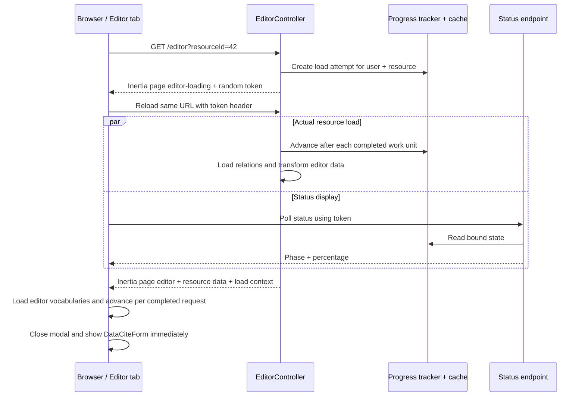

# Implementation Plan: Real Loading Progress for Existing Resources in the Data Editor

## Goal and Agreed Scope

Opening an existing resource immediately displays a non-dismissible loading
view in the destination tab. The view uses the shadcn `Dialog` and `Progress`
components. This applies whether the resource is opened from `/resources`, the
Dashboard, Assistance, or a direct `/editor?resourceId=...` link.

Progress is based exclusively on completed server-side and client-side work.
The messages advance independently every two seconds. The editor form appears
as soon as it is fully usable, without an artificial minimum delay.

The following are out of scope:

- the empty editor without `resourceId`;
- XML or JSON upload sessions;
- the legacy editor path using `oldDatasetId`;
- replacing the existing multi-tab behaviour on `/resources` with a different
  navigation model;
- moving the loading work to a queue.

## Acceptance Criteria

- Every entry point for an existing resource displays the loading view in the
  editor tab or current destination tab.
- For a multi-selection on `/resources`, every opened tab has an independent
  load bound to its user and resource.
- The progress bar advances only when a defined loading phase has completed;
  message timing never controls its value.
- The following messages appear in this exact order:

    1. `Preparing the Data Editor for the Data Curators' work`
    2. `Load user-specific settings for Data Editor`
    3. `Ask ELMO if Cookie Monster still has any cookies`
    4. `Load unicorns into the DataCite cache`
    5. `Groan under the weight of the huge dataset`
    6. `Who on earth works with such massive datasets?`

- Message 1 is shown from 0–2 seconds, message 2 from 2–4 seconds, and so on.
  Message 6 remains visible from second 10 onwards, including after second 12.
- If the editor becomes ready during a message interval, it appears
  immediately; the current message is not artificially kept visible for the
  full two seconds.
- The loading view remains visible until both the server-side resource
  preparation and the existing client-side editor vocabulary requests finish.
- A total load time of at least 12 seconds creates exactly one `warning` log
  entry per load attempt.
- The canonical `/editor?resourceId=...` URL remains unchanged and the progress
  token never appears in the URL.
- Errors offer retry and back navigation and never leave an empty tab.
- New editors, upload sessions, and legacy datasets retain their existing
  behaviour.

## Target Architecture

The second request remains synchronous. This avoids queue latency and avoids
temporarily serialising the complete editor payload into the cache. The cache
contains only small progress records.

## Implementation Steps

### 1. Add a User-Bound Progress Model

Add a dedicated tracker under `app/Services/Editor`. It manages one random UUID
with a short time-to-live, such as 15 minutes, for each load attempt.

The cache record contains only technical data:

- token or token-based cache key;
- `user_id` and `resource_id`;
- a status such as `pending`, `loading`, `server_ready`, `failed`, or `complete`;
- the last completed phase and percentage;
- start and update timestamps;
- optionally, durations of completed server phases;
- whether the slow-load warning has already been written.

The tracker provides typed operations for starting, validating, advancing,
failing, and completing a load. Token access is always checked against the
authenticated user and expected resource. Invalid UUIDs, expired tokens, and
foreign user/resource combinations reveal no status information.

Define the 12-second threshold and cache TTL centrally in the backend. Pass the
threshold to the loading page as a prop so frontend and backend cannot diverge.

### 2. Divide Existing Resource Loading into Real Phases

`EditorController::show()` retains the existing priority for XML, JSON, legacy
datasets, and new editors. Only the branch for an existing `resourceId` becomes
a two-step process:

1. A request without the progress header validates the resource using a small
   query, creates a load attempt, and renders `editor-loading`.
2. The loading page performs an Inertia reload of the same URL with a header
   such as `X-Editor-Load-Token`. Only this request loads the complete resource.

Split the current large `with([...])` query into cohesive `load()` phases. The
cache advances only after an entire phase succeeds. Planned groups include:

- resource base record and common editor settings;
- type, language, titles, rights, descriptions, and dates;
- creators, contributors, polymorphic people or organisations, roles, and
  affiliations;
- subjects and spatial coverage;
- related identifiers, funding references, instruments, datacenter, and
  landing page;
- transformation of loaded models into editor props.

Explicitly eager-load nested relations used by the transformer, especially
`descriptions.descriptionType` and `dates.dateType`. The phase split must not
introduce N+1 queries and may reduce existing implicit queries.

For very large collections, let
`EditorDataTransformer::transformResource()` accept an optional neutral
progress callback or reporter. It reports completed transformation groups
without coupling the transformer to cache or HTTP logic. Existing callers that
omit the reporter retain exactly the same result.

Server phases occupy only the first part of the bar, for example 0–75%. Define
their weights centrally and monotonically. They represent completed units of
work and are explicitly not a time-remaining estimate.

### 3. Add Status and Slow-Load Endpoints

Add two small endpoints to the existing authenticated route group:

- `GET` returns the status, phase, and percentage for a token;
- `POST` reports that the loading view is still visible after 12 seconds.

A small `EditorLoadProgressController` validates the UUID and user/resource
binding through the tracker. Status responses use `Cache-Control: no-store`. If
a rate limit is added, it must be scoped by both user and token so multiple
selected resources do not throttle each other's tabs.

Generate the new Laravel routes through
`php artisan ernie:wayfinder-generate --with-form`; do not edit generated files
manually.

### 4. Guarantee Exactly-One Slow-Load Logging

The tracker checks the threshold during server-side phase changes and
completion, as well as when the frontend explicitly reports after 12 seconds.
An atomic cache marker, for example `Cache::add`, prevents duplicate log lines
from concurrent requests.

The warning uses the standard Laravel log and includes:

- a stable message such as `Slow Data Editor resource load`;
- `user_id`;
- `resource_id`;
- `duration_ms`;
- latest known phase and percentage;
- whether server processing or client initialisation triggered it.

Do not log resource metadata, titles, DOI values, or complete payloads. Normal
loads create no extra entry. Technical loading failures continue to be
reported separately as errors.

### 5. Build a Reusable shadcn Loading Modal

Create a component under `resources/js/components/editor` using existing
shadcn components:

- `Dialog` and `DialogContent` without a close button;
- `DialogTitle` and `DialogDescription`;
- `Progress`;
- `Button` for the error state.

The active dialog cannot be dismissed with Escape or an overlay click. The
browser tab itself can still be closed normally. Use `Loading Data Editor` as
the title.

Move message timing into a small hook:

- start when the modal first appears;
- advance based on elapsed time in 2,000-millisecond intervals;
- clamp the index at the sixth message;
- preserve timing across the Inertia transition from `editor-loading` to
  `editor` using the per-tab token;
- clean up timers completely on success, failure, or unmount.

The message timer never changes progress. Use `aria-live="polite"` for status
text and give the progress bar an accessible label and current value. Respect
`prefers-reduced-motion` for progress transitions, if necessary through a small
general-purpose change to the existing shadcn `Progress` component.

### 6. Add a Lightweight Inertia Loading Page

`resources/js/pages/editor-loading.tsx` renders the regular application frame
and opens the loading modal immediately. On mount it:

- starts the two-second message sequence;
- polls the protected status endpoint at a short but moderate interval;
- starts exactly one Inertia reload of the same canonical editor URL with the
  token header;
- suppresses the global NProgress indicator for this internal reload so the UI
  does not show competing progress bars;
- replaces the loader history entry during the transition so Back returns to
  the actual origin.

Temporary polling errors do not stop the editor request. A real backend loading
failure switches the modal to a clear error state.

`Try again` uses a full reload of the canonical URL to create a fresh,
independent attempt. `Go back` uses browser history and falls back to
`/resources` when there is no meaningful origin.

### 7. Include Client-Side Editor Initialisation in Real Progress

After the Inertia transition, `resources/js/pages/editor.tsx` still loads
resource types, title types, date types, description types, licences,
languages, and three role sets. For an existing resource, keep the shared
loading modal open until these values are actually available.

Refactor initialisation so each completely received and parsed dataset reports
a real client-side step:

- session warm-up/resource types completed;
- each of the eight parallel vocabulary or role endpoints completed;
- final React readiness of `DataCiteForm`.

These steps fill the reserved final section of the bar, for example 75–100%.
Parallel responses increment a completed counter managed safely through React
state or a local counter. Progress remains monotonic within an attempt.

Remove the modal and show `DataCiteForm` immediately when `isEditorReady`
becomes true. Do not add another timeout or wait for the current message to
finish. Editor requests without a resource progress context keep the existing
skeleton and error flow.

If a required client request fails for an existing resource, display the shared
modal error state. A retry starts a new load attempt so progress, timing, and
slow-load logging remain unambiguous.

### 8. Cover Every Entry Point Without Duplicating URLs

Dashboard, Assistance, `/resources`, popup fallbacks, and direct links already
use `/editor?resourceId=...`. Because branching happens in `EditorController`,
these components do not need special loader URLs.

Verify especially:

- row clicks and keyboard activation on `/resources`;
- Edit for a single selection;
- Edit for multiple resources, with one token per tab;
- the existing dialog for browser-blocked tabs;
- dashboard links to recently edited resources;
- resource links in Assistance;
- directly entered or reloaded editor URLs.

Keep the existing `openDetachedTab()` behaviour and popup detection. The modal
therefore appears in the newly opened tab rather than the remaining
`/resources` tab.

## Planned Tests

### Backend/Pest

- Guest access remains protected.
- `/editor` without `resourceId` still renders the empty editor directly.
- XML, JSON, and `oldDatasetId` paths bypass the new resource loader.
- The first request with `resourceId` renders `editor-loading` and creates a
  valid short-lived load attempt.
- A valid token header for the same user and resource then renders `editor`
  with an unchanged prop payload.
- Missing, malformed, expired, and foreign tokens are rejected.
- A token cannot be used for a different resource or user.
- Status values advance monotonically with completed phases.
- Transformation results and existing landing-page, title-type, and MSL
  Laboratory round trips remain unchanged.
- Nested relations are eager loaded and a query-count regression test protects
  against new N+1 behaviour.
- No warning is written at 11,999 milliseconds; exactly one is written from
  12 seconds, even when server and frontend report almost simultaneously.
- The slow log contains technical context fields but no resource payload.
- Failures mark the load attempt and return the loader error state.

Existing feature tests that expect `component('editor')` immediately after one
`GET /editor?resourceId=...` use a reusable two-step helper instead. This
especially affects `EditorTest`, `EditorTitleTypeMappingTest`, and
`MslLaboratoryRoundtripTest`.

### Frontend/Vitest

- The modal is open, non-dismissible, and uses accessible Dialog and Progress
  labels.
- Fake timers verify all six messages at 0, 2, 4, 6, 8, 10, and more than
  12 seconds.
- An early successful load hides the modal immediately.
- Poll responses change the bar; elapsed time alone does not.
- Server and client progress connect without moving backwards.
- Parallel vocabulary requests increment the completed count correctly and the
  form appears only when all are ready.
- Timers and polling are removed on unmount.
- The slow-load signal is sent once after 12 seconds.
- Backend and client errors show Retry and Back; Retry creates a fresh attempt.
- Reduced Motion disables unnecessary progress transitions.
- Existing tests for resource rows, multiple selection, blocked tabs, and
  Dashboard and Assistance links continue to confirm canonical editor URLs.

### Optional Browser Smoke Test

Using a test resource, verify that a real click from `/resources` opens a new
tab, initially displays the modal, and then renders the populated editor form.
Do not introduce an artificial production delay for this test.

## Expected Files

- `app/Http/Controllers/EditorController.php`
- new `app/Http/Controllers/EditorLoadProgressController.php`
- new tracker and possibly a stage enum under `app/Services/Editor` or
  `app/Enums`
- `app/Services/Editor/EditorDataTransformer.php`
- `routes/web.php`
- new `resources/js/pages/editor-loading.tsx`
- `resources/js/pages/editor.tsx`
- new components and hooks under `resources/js/components/editor` and
  `resources/js/hooks`
- optionally `resources/js/components/ui/progress.tsx` only for Reduced Motion
- generated Wayfinder routes
- new focused Pest and Vitest tests plus updates to existing editor feature
  tests

## Recommended Implementation Order

1. Implement the tracker, security binding, phase model, and backend tests.
2. Make `EditorController` two-stage and split resource loading into phases
   without changing the payload.
3. Add status and slow-load endpoints and Wayfinder helpers.
4. Implement the shared modal, message hook, and `editor-loading` page.
5. Integrate the existing client-side editor warm-up into the remaining real
   progress steps.
6. Complete error and retry paths.
7. Update or extend existing editor, resource, Dashboard, and Assistance tests.
8. Run type checks, linting, backend analysis, focused tests, and finally the
   complete relevant test suites.

## Verification Before Completion

- `npm run types`
- `npm run lint:check`
- focused Vitest suites for the loader, editor, and existing-resource entry
  points
- focused Pest suites for editor loading, the transformer, and round trips
- `npm run phpstan:check`
- `npm run test:run`
- `npm run test:php`
- optionally `npm run test:e2e` or the appropriate development-stack smoke test

Before merging, manually test one small and one unusually large resource.
Confirm that percentages advance only at real phase boundaries, the final
message remains after 12 seconds, and exactly one warning is logged.
