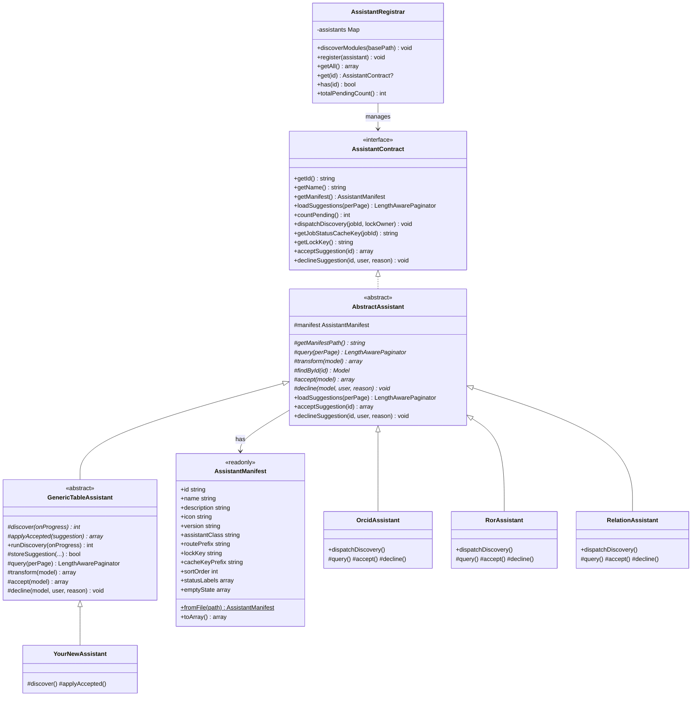
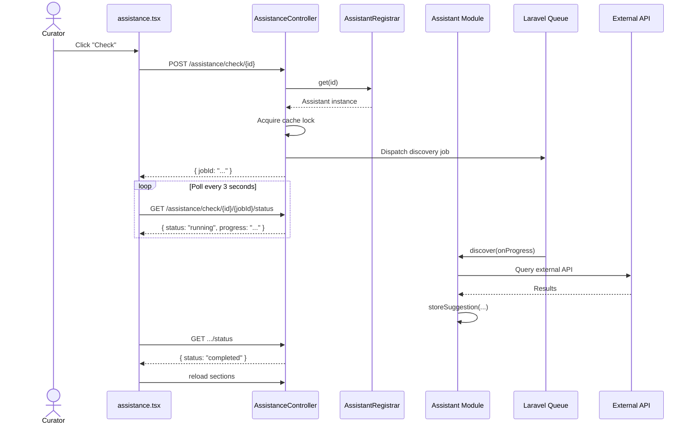
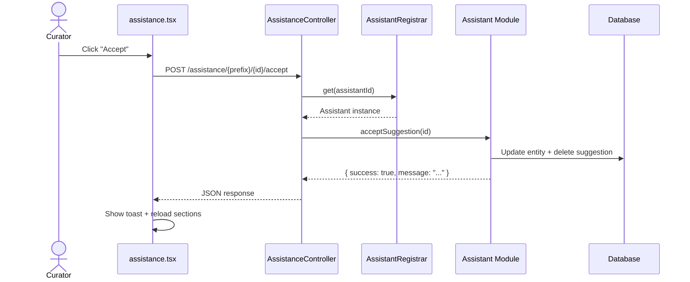

# Assistance Module — Developer Guide

## Table of Contents

1. [Overview](#overview)
2. [Architecture](#architecture)
3. [How Auto-Discovery Works](#how-auto-discovery-works)
4. [Existing Assistants](#existing-assistants)
5. [Creating a New Assistant (Step-by-Step)](#creating-a-new-assistant-step-by-step)
6. [The `manifest.json` File](#the-manifestjson-file)
7. [The `Assistant.php` File](#the-assistantphp-file)
8. [Storage: Generic vs. Custom Tables](#storage-generic-vs-custom-tables)
9. [Frontend Integration](#frontend-integration)
10. [Testing Your Assistant](#testing-your-assistant)
11. [Class Diagram](#class-diagram)
12. [Sequence Diagrams](#sequence-diagrams)
13. [File Tree](#file-tree)
14. [FAQ](#faq)

---

## Overview

The **Assistance** feature helps curators enrich metadata by automatically discovering missing information (ORCIDs, ROR-IDs, related works, etc.) and presenting suggestions in a unified UI.

Each assistant is a **self-contained module** inside `modules/assistants/`. Removing the folder removes the assistant — no other files need to change.

```
modules/assistants/
├── OrcidSuggestion/       ← discovers missing ORCIDs
├── RorSuggestion/         ← discovers missing ROR-IDs
├── RelationSuggestion/    ← discovers related works
└── YourNewAssistant/      ← your new assistant goes here
```

---

## Architecture

```
┌─────────────────────────────────────────────────────────┐
│  Browser (React)                                        │
│  assistance.tsx  ← renders cards for each assistant     │
└────────────────┬────────────────────────────────────────┘
                 │  Inertia.js / axios
┌────────────────▼────────────────────────────────────────┐
│  AssistanceController  (thin orchestrator)               │
│  - Delegates all work to the Registrar + Assistants     │
└────────────────┬────────────────────────────────────────┘
                 │
┌────────────────▼────────────────────────────────────────┐
│  AssistantRegistrar  (singleton)                         │
│  - Scans modules/assistants/{name}/manifest.json        │
│  - Instantiates Assistant classes via Laravel container  │
│  - Provides getAll(), get(id), totalPendingCount()      │
└────────────────┬────────────────────────────────────────┘
                 │
     ┌───────────┼───────────────┐
     ▼           ▼               ▼
┌─────────┐ ┌─────────┐  ┌──────────────┐
│ ORCID   │ │  ROR    │  │  Relation    │   ← existing assistants
│ Module  │ │ Module  │  │  Module      │      (own DB tables)
└─────────┘ └─────────┘  └──────────────┘

                 ┌──────────────────────┐
                 │  Your New Module     │   ← new assistants
                 │  (generic DB tables) │      (shared tables)
                 └──────────────────────┘
```

---

## How Auto-Discovery Works

1. On every HTTP request, `AssistantServiceProvider` boots.
2. It tells `AssistantRegistrar` to scan `modules/assistants/`.
3. For each subfolder with a `manifest.json`, the registrar:
   - Parses the manifest.
   - Instantiates the PHP class named in `"assistant_class"`.
   - Registers it in its internal list (sorted by `sort_order`).
4. Dynamic routes are created for each registered assistant.
5. The controller delegates all requests to the correct assistant.

**Key insight:** If the folder does not exist, **nothing happens**. No errors, no routes, no data.

---

## Existing Assistants

| Module | ID | What it discovers | DB Tables |
|--------|----|-------------------|-----------|
| `OrcidSuggestion/` | `orcid-suggestion` | Missing ORCIDs for creators/contributors | `suggested_orcids`, `dismissed_orcids` |
| `RorSuggestion/` | `ror-suggestion` | Missing ROR-IDs for affiliations/institutions/funders | `suggested_rors`, `dismissed_rors` |
| `RelationSuggestion/` | `relation-suggestion` | Related works from ScholExplorer + DataCite Events | `suggested_relations`, `dismissed_relations` |

These three use **their own database tables** (created before the modular system) and extend `AbstractAssistant`.

---

## Creating a New Assistant (Step-by-Step)

### 1. Create the folder

```
modules/assistants/SpdxLicenseSuggestion/
```

> **Convention:** Use PascalCase for the folder name (like a PHP class name).

### 2. Create `manifest.json`

```json
{
    "id": "spdx-license-suggestion",
    "name": "Suggested Licenses",
    "description": "Discover SPDX license identifiers for resources.",
    "icon": "Scale",
    "version": "1.0.0",
    "assistant_class": "Modules\\Assistants\\SpdxLicenseSuggestion\\Assistant",
    "route_prefix": "licenses",
    "lock_key": "license_discovery_running",
    "cache_key_prefix": "license_discovery",
    "sort_order": 40
}
```

### 3. Create `Assistant.php`

```php
<?php

declare(strict_types=1);

namespace Modules\Assistants\SpdxLicenseSuggestion;

use App\Models\AssistantSuggestion;
use App\Services\Assistance\GenericTableAssistant;
use Closure;

class Assistant extends GenericTableAssistant
{
    protected function getManifestPath(): string
    {
        return __DIR__ . '/manifest.json';
    }

    /**
     * Query an external API and store new suggestions.
     *
     * @param  Closure(string): void  $onProgress
     */
    protected function discover(Closure $onProgress): int
    {
        $count = 0;

        // Example: iterate over resources that have no license
        $resources = \App\Models\Resource::whereDoesntHave('rights')->get();

        foreach ($resources as $index => $resource) {
            $onProgress("Checking resource " . ($index + 1) . " of " . $resources->count());

            // TODO: Call SPDX API or your logic here
            $suggestedLicense = $this->lookupLicense($resource);

            if ($suggestedLicense !== null) {
                $stored = $this->storeSuggestion(
                    resourceId: $resource->id,
                    targetType: 'resource',
                    targetId: $resource->id,
                    suggestedValue: $suggestedLicense['identifier'],
                    suggestedLabel: $suggestedLicense['name'],
                    similarityScore: $suggestedLicense['confidence'] ?? null,
                );

                if ($stored) {
                    $count++;
                }
            }
        }

        return $count;
    }

    /**
     * Apply the suggestion when a curator clicks "Accept".
     *
     * @return array{success: bool, message: string}
     */
    protected function applyAccepted(AssistantSuggestion $suggestion): array
    {
        // TODO: Create the license record for the resource
        // Example:
        // Right::create([
        //     'resource_id' => $suggestion->resource_id,
        //     'rights_identifier' => $suggestion->suggested_value,
        //     'rights' => $suggestion->suggested_label,
        // ]);

        return [
            'success' => true,
            'message' => "License '{$suggestion->suggested_label}' applied.",
        ];
    }

    /**
     * Your custom lookup logic.
     *
     * @return array{identifier: string, name: string, confidence: float}|null
     */
    private function lookupLicense(\App\Models\Resource $resource): ?array
    {
        // Implement your lookup here
        return null;
    }
}
```

### 4. Run `composer dump-autoload`

```bash
docker exec ernie-app-dev composer dump-autoload
```

### 5. Done!

Visit `/assistance` — your new assistant appears automatically.

---

## The `manifest.json` File

Every assistant **must** have a `manifest.json` in its root folder.

| Field | Type | Required | Description |
|-------|------|----------|-------------|
| `id` | string | ✅ | Unique kebab-case identifier (e.g. `"spdx-license-suggestion"`) |
| `name` | string | ✅ | Display name shown in the UI card header |
| `description` | string | ✅ | Subtitle shown below the card title |
| `icon` | string | ✅ | Lucide icon name (e.g. `"Scale"`, `"User"`, `"Building2"`) |
| `version` | string | ✅ | Semver version (e.g. `"1.0.0"`) |
| `assistant_class` | string | ✅ | Fully-qualified PHP class name |
| `route_prefix` | string | ✅ | URL segment for accept/decline routes (e.g. `"licenses"`) |
| `lock_key` | string | ✅ | Cache lock key to prevent concurrent discovery runs |
| `cache_key_prefix` | string | ✅ | Prefix for job status cache entries |
| `sort_order` | int | ❌ | Display order (lower = higher, default: 100) |
| `status_labels` | object | ❌ | Custom status messages (has sensible defaults) |
| `empty_state` | object | ❌ | Custom "all done" text (has sensible defaults) |
| `card_component` | string | ❌ | Custom TSX component filename (null = generic card) |

---

## The `Assistant.php` File

### For new assistants: extend `GenericTableAssistant`

You only implement **two methods**:

```php
// 1. Where is your manifest.json?
protected function getManifestPath(): string
{
    return __DIR__ . '/manifest.json';
}

// 2. How do you discover suggestions?
protected function discover(Closure $onProgress): int
{
    // Query an API, iterate over resources, call $this->storeSuggestion(...)
    // Call $onProgress('message') to report progress
    // Return the number of NEW suggestions stored
}

// 3. What happens when a curator clicks "Accept"?
protected function applyAccepted(AssistantSuggestion $suggestion): array
{
    // Update the database entity (create a record, set a field, etc.)
    // Return ['success' => true/false, 'message' => '...']
}
```

### The `storeSuggestion()` helper

Call this inside `discover()` to store a suggestion:

```php
$this->storeSuggestion(
    resourceId:      $resource->id,     // FK to resources table (nullable)
    targetType:      'person',          // what entity type you're enriching
    targetId:        $person->id,       // PK of that entity
    suggestedValue:  '0000-0001-...',   // the actual suggestion
    suggestedLabel:  'Jane Doe ORCID',  // human-readable label for the UI
    similarityScore: 0.95,              // optional confidence (0.0 – 1.0)
    metadata:        ['source' => 'api'] // optional extra data (stored as JSON)
);
```

It automatically **skips duplicates** and **skips previously dismissed** suggestions.

---

## Storage: Generic vs. Custom Tables

| Approach | Used by | Tables |
|----------|---------|--------|
| **Custom tables** (legacy) | ORCID, ROR, Relation | `suggested_orcids`, `dismissed_orcids`, etc. |
| **Generic tables** (new) | All new assistants | `assistant_suggestions`, `assistant_dismissed` |

New assistants use the **generic tables** (`assistant_suggestions` and `assistant_dismissed`). You don't write migrations — the tables already exist.

The `assistant_id` column links suggestions to your module. When your module is removed, its suggestions remain in the database but are never displayed (because no module loads them).

---

## Frontend Integration

The frontend page (`assistance.tsx`) renders a **card per assistant** based on the `manifests` array from the backend.

For the three existing assistants, there are custom card components with specialized UI (similarity badges, entity type labels, etc.).

For **new assistants**, the page renders a **generic card** showing:
- `suggested_label` as the main text
- `discovered_at` as a timestamp
- Accept / Decline buttons

If you need a custom card, create a `.tsx` file in your module folder and set `"card_component"` in your manifest. Then update the `renderCard()` switch in `assistance.tsx` to import it.

---

## Testing Your Assistant

### Unit test (Pest)

Create `tests/pest/Feature/YourAssistantTest.php`:

```php
<?php

use App\Models\Resource;
use App\Models\User;
use App\Services\Assistance\AssistantRegistrar;
use Modules\Assistants\SpdxLicenseSuggestion\Assistant;

it('registers via auto-discovery', function () {
    $registrar = app(AssistantRegistrar::class);

    expect($registrar->has('spdx-license-suggestion'))->toBeTrue();
});

it('returns suggestions for the assistance page', function () {
    $user = User::factory()->admin()->create();

    $this->actingAs($user)
        ->get('/assistance')
        ->assertOk()
        ->assertInertia(fn ($page) => $page
            ->component('assistance')
            ->has('manifests')
            ->has('sections')
        );
});
```

### Running tests

```bash
# All tests
docker exec ernie-app-dev bash -c "XDEBUG_MODE=coverage ./vendor/bin/pest --no-coverage"

# Specific test file
docker exec ernie-app-dev bash -c "XDEBUG_MODE=coverage ./vendor/bin/pest tests/pest/Feature/YourAssistantTest.php --no-coverage"
```

---

## Class Diagram



---

## Sequence Diagrams

### Discovery Flow (Check one assistant)



### Accept Flow



---

## File Tree

```
modules/assistants/
├── DEVELOPER_GUIDE.md              ← you are here
│
├── OrcidSuggestion/                ← existing module
│   ├── manifest.json
│   └── Assistant.php               ← extends AbstractAssistant
│
├── RorSuggestion/                  ← existing module
│   ├── manifest.json
│   └── Assistant.php               ← extends AbstractAssistant
│
├── RelationSuggestion/             ← existing module
│   ├── manifest.json
│   └── Assistant.php               ← extends AbstractAssistant
│
└── YourNewAssistant/               ← your new module
    ├── manifest.json               ← describes your assistant
    └── Assistant.php               ← extends GenericTableAssistant

app/Services/Assistance/
├── AssistantContract.php           ← interface (10 methods)
├── AssistantManifest.php           ← readonly value object (parsed manifest)
├── AssistantRegistrar.php          ← singleton registry (auto-discovery)
├── AbstractAssistant.php           ← base class for existing assistants
└── GenericTableAssistant.php       ← base class for NEW assistants

app/Models/
├── AssistantSuggestion.php         ← generic suggestions table model
└── AssistantDismissed.php          ← generic dismissed table model

app/Jobs/
└── DiscoverAssistantSuggestionsJob.php  ← generic discovery job

app/Providers/
└── AssistantServiceProvider.php    ← registers routes + singleton

app/Http/Controllers/
└── AssistanceController.php        ← thin orchestrator (~190 lines)
```

---

## FAQ

### Q: Do I need to write a database migration?
**No.** New assistants use the shared `assistant_suggestions` and `assistant_dismissed` tables. These already exist.

### Q: Do I need to create a queue job?
**No.** `GenericTableAssistant` automatically uses `DiscoverAssistantSuggestionsJob`, which calls your `discover()` method.

### Q: How do I remove my assistant?
Delete its folder under `modules/assistants/`. Run `composer dump-autoload`. Done.

### Q: Can I inject services into my Assistant class?
**Yes.** The class is instantiated via Laravel's service container, so constructor injection works:

```php
public function __construct(
    private readonly MyApiService $api,
) {
    parent::__construct();
}
```

### Q: Where do I put helper classes?
In your module folder. For example: `modules/assistants/SpdxLicenseSuggestion/SpdxApiClient.php`. Just follow PSR-4 naming (`Modules\Assistants\SpdxLicenseSuggestion\SpdxApiClient`).

### Q: How does the generic card look?
It shows `suggested_label` as the title, `discovered_at` as a date, and Accept/Decline buttons. For a custom card, set `"card_component"` in your manifest and add a switch case in `assistance.tsx`.

### Q: What if `discover()` takes a long time?
It runs on the **queue** in the background. The curator sees a progress bar. Call `$onProgress('Processing item 5 of 100')` frequently so the UI stays responsive.

### Q: Can I test with fake data?
Yes. In your test, create `AssistantSuggestion` records directly:

```php
use App\Models\AssistantSuggestion;

AssistantSuggestion::create([
    'assistant_id' => 'spdx-license-suggestion',
    'resource_id' => $resource->id,
    'target_type' => 'resource',
    'target_id' => $resource->id,
    'suggested_value' => 'MIT',
    'suggested_label' => 'MIT License',
    'discovered_at' => now(),
]);
```
